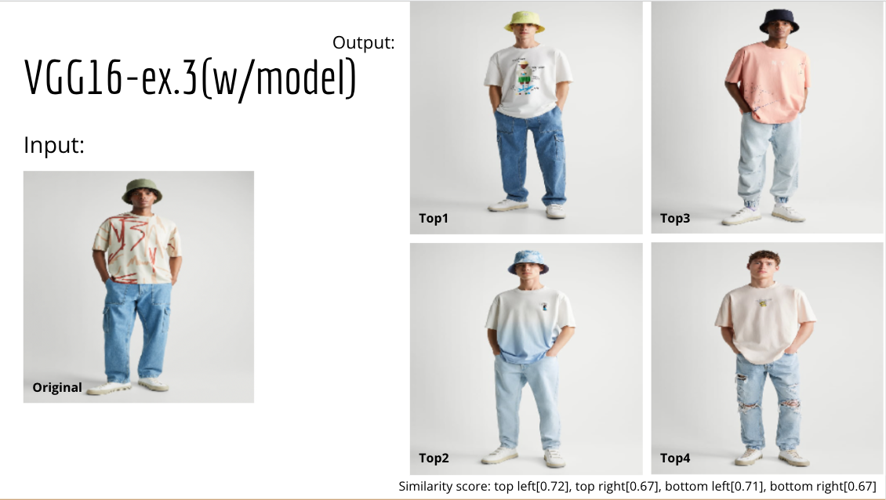
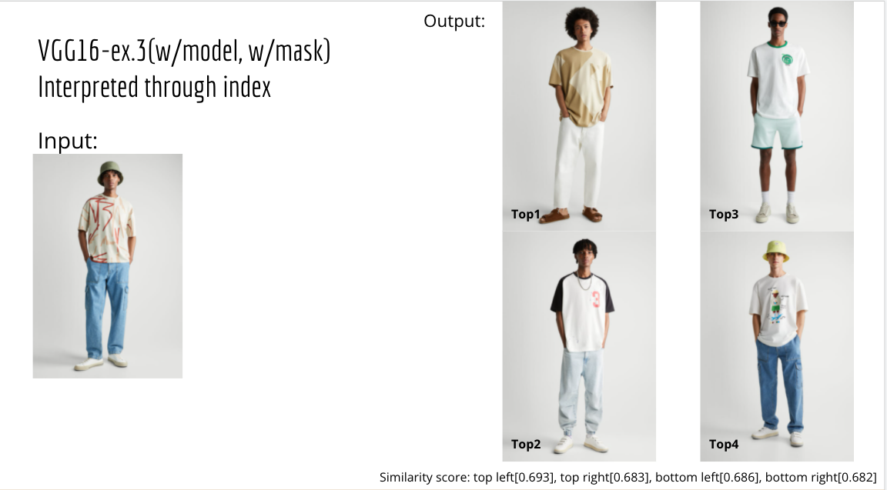
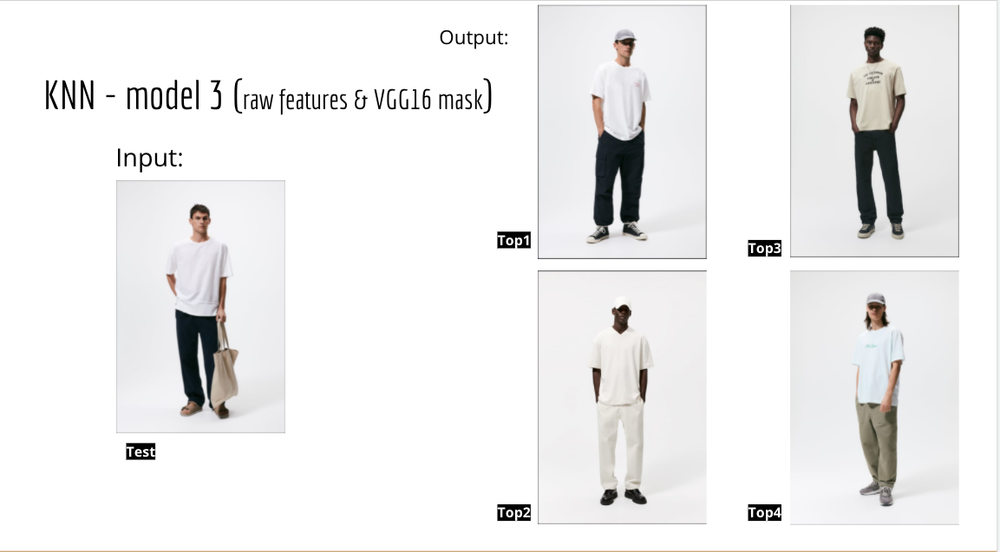

# DrexelUniversity-CapstoneI&II-EWeaver:Sustainable Clothing Aggregation and Recommendation System

## Abstract

The fashion industry has been grappling with the demands of consumers to shift towards a more "sustainable" manufacturing process and offer consumers better options to meet their moral beliefs. Although many tools are used by industry to measure clothing sustainability, few brands consider the entire "cradle-to-grave" life-cycle of textiles to better their product and practices;  more established household brands experience difficulty replacing timely, cost-effective methods for "eco-friendly" ones. Thus we propose a sustainable clothing recommendation system called E-Weaver, which will incorporate state-of-the-art image processing methods for feature extraction and a novel sustainability metric to assist consumers with purchasing more environmentally-conscious products. This repository contains the data collected and all the related work.

Here are the schematic diagram for the data collection.

Here are the schematic diagram of entire system framework

## WebScraper

This folder contains scraper script for each individual brands. Due to the different website structure, it is hard to design an universal pipeline for all the brands. Some brands' scraper scripts are not included here

## data

    * E-Weaver.csv: Cleaned, combined brands dataset of E-Weaver_data.csv. There are 23 brands selected based on ratings from GoodOnYou.eco website. Total 2833 unique T-shirts in the dataset
    * clean_brand_data: Cleaned brand meta-data csv files, also contains a data_combine.py which populates E-Weaver.csv
    * image_data: Downloaded original image from E-Weaver.csv's imageUrl Column
    * mask_data: Zipped mask pickles from MRCNN model
    * mask_pkls: An empty folder to be used to contain unzipped mask pickles from mask_data
    * masked_image_data: 1420 masked images after applying mask pickles on the raw images
    * misc: GOY_brand_data.json which contains data to help calculate sustainability index; 537.png, an example of bad image to filter out by code
    * mixed_image_data: 1420 masked images + 1413 unmasked images
    * raw_brand_data: Scrapped csv files from selected online retailers
    * sustainability: csv file of sustainaility score for each T-shirt

## preprocess

This folder contains majority of the cleaning scripts for each brands. Some brand's preprocess script is not included. 
image_download.py is used to automatically download all the raw image to data/image_data folder, image_prepocess.ipynb is used to clean the raw image downloaded. 
Two types of problem image, one is that image can't be opened and another is a watermark of brand logo only. Reference data/misc/537.png for the watermark image. These are caused when the imageUrl links are being updated by other photos, or simply the product is being removed.

## sustainability_index

This folder contains the work related to calculating the sustainbility index for all the T-shirts

## EDA 

This folder contains EDA_making_figures.ipynb EDA.py two separate work with some key finidngs from the E-Weaver_data.csv. material_distribution.xlsx is used to generate a detailed material composition pie chart

Here are the histrogram plot of price bin of all the T-shirts

Here are the pie chart of materials distribution of all the T-shirts

## Model

    * vgg16.ipynb: Input is all the raw image and output a similarity_deep.pkl and flatten_matrix.pkl. The former one is used to reduce feature extractio time, latter is used as input to KNN model in separate work. This notebook can also display n recommend T-shirt based on given matrix index and similarity_deep matrix
    * vgg16-masked-img.ipynb: Most part is duplicated from vgg16.ipynb except this notebook is used to extract features from masked images, also able to show n recommend T-shirt
    * model.py: Framework for KNN model
    * mask-rcnn/: masking_example.ipynb on how to load a mask pickle. masking_image.ipynb automatically apply mask pickle objects to raw images and save them in data/masked_image_data, also save masked image and rest unmasked in data/mixed_image_data
   **For Masked R-CNN model source code and parameters file, see https://github.com/sugi-chan/clothes_segmentation**

## Result

Here is result using VGG16 extracted features from raw images, and calculated cosine similarity

Here is the same process on masked images

Here is the KNN result after fused E-Weaver.csv meta-data and features extracted from vgg16 with masked images

## Future Work

    1. Getting more data, if users data are possilbe such as ratings, number or reivews
    2. It is desired to go deeper on the raw image preprocess. The ideal clean image is without model and only has product itself through MRCNN or other segmentation work(some of MRCNN masking results are not satisfied). Unify the backgroung color of all image
    3. Extract a majority color pixel from the T-shirt image

## For More Information

For any additional questions, please contact team members: [Dayun Piao](https://github.com/claude0124) - claude0124p@gmail.com | [Colin Murphy](https://github.com/Curf) - ClnJMurph@gmail.com | [Matthew Merenich](https://github.com/mmerenich21) - m.merenich21@gmail.com | [Zifeng Wang](https://github.com/princepeak) - wangzf.sec@gmail.com.
