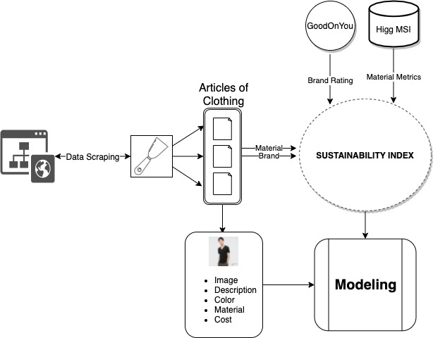
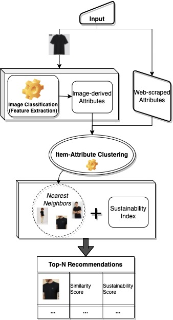
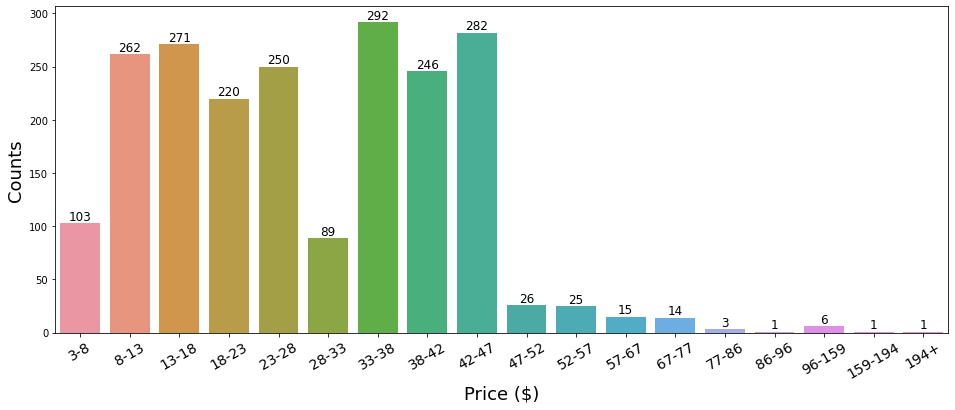
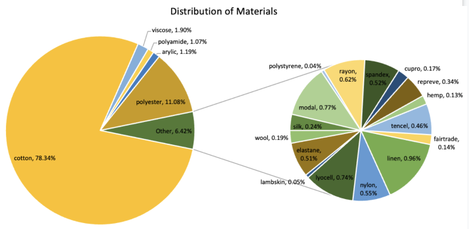

# DSCI591-Fall21-E-Weaver:Sustainable Clothing Aggregation and Recommendation System

## Abstract

The fashion industry has been grappling with the demands of consumers to shift towards a more "sustainable" manufacturing process and offer consumers better options to meet their moral beliefs. Although many tools are used by industry to measure clothing sustainability, few brands consider the entire "cradle-to-grave" life-cycle of textiles to better their product and practices;  more established household brands experience difficulty replacing timely, cost-effective methods for "eco-friendly" ones. Thus we propose a sustainable clothing recommendation system called E-Weaver, which will incorporate state-of-the-art image processing methods for feature extraction and a novel sustainability metric to assist consumers with purchasing more environmentally-conscious products. This repository contains the data collected and combined final dataset.

Here are the schematic diagram for the data collection.

Here are the schematic diagram of entire system framework - image classifcation and clustering.

## data

This folder contains the cleaned, combined dataset of E-Weaver_data.csv. There are 11 brands total and 2107 unique T-shirts in the dataset as of 12/8/21. As well as raw data, image data, cleaned data in the respective folders. The GOY_brand_data.json contains the data from Good On You websites which provides sustainability level for each brands.

## WebScraper

This folder contains scraper script for each individual brands. Due to the different website structure, it is hard to design an universal pipeline for all the brands.

## preprocess

This folder contains the cleaning scripts for each individual brands.

## EDA 

This folder contains some key finidngs from the E-Weaver_data.csv. 

Here are the histrogram plot of price bin of all the T-shirts

Here are the pie chart of materials distribution of all the T-shirts

## sustainability_index

This folder contains the work related to calculating the sustainbility index for all the T-shirts

## Future Work

In the second half the capstone, the conceptualization of the E-Weaver as a clothing recommendation platform will be continued -- the model development will be the focus of our work moving forward.

